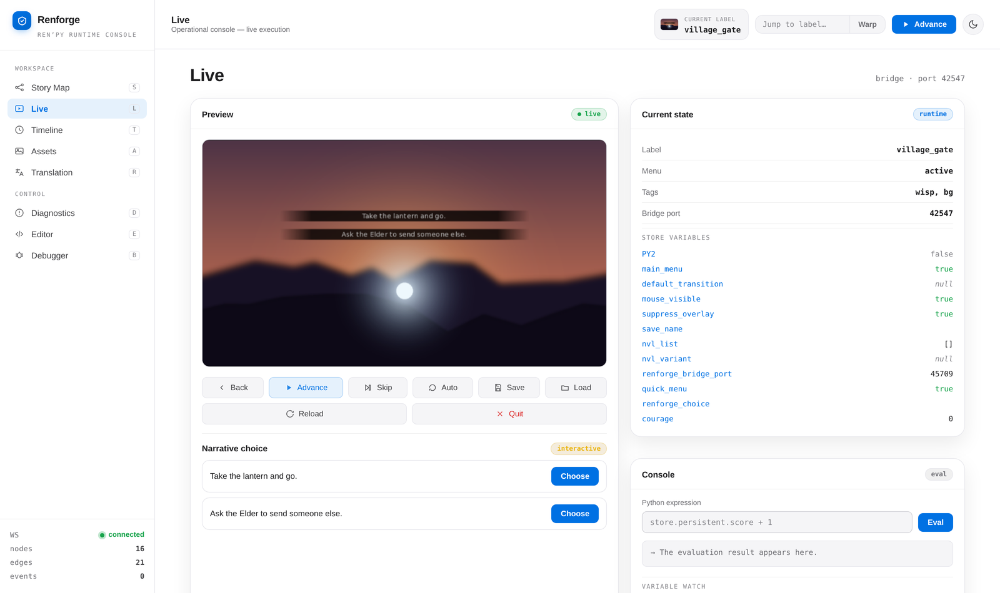
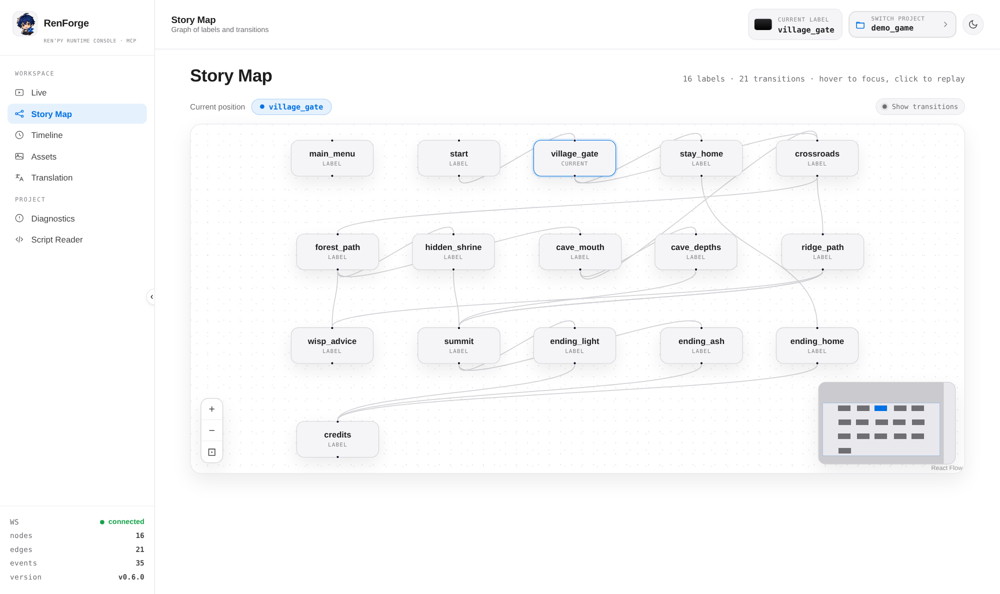
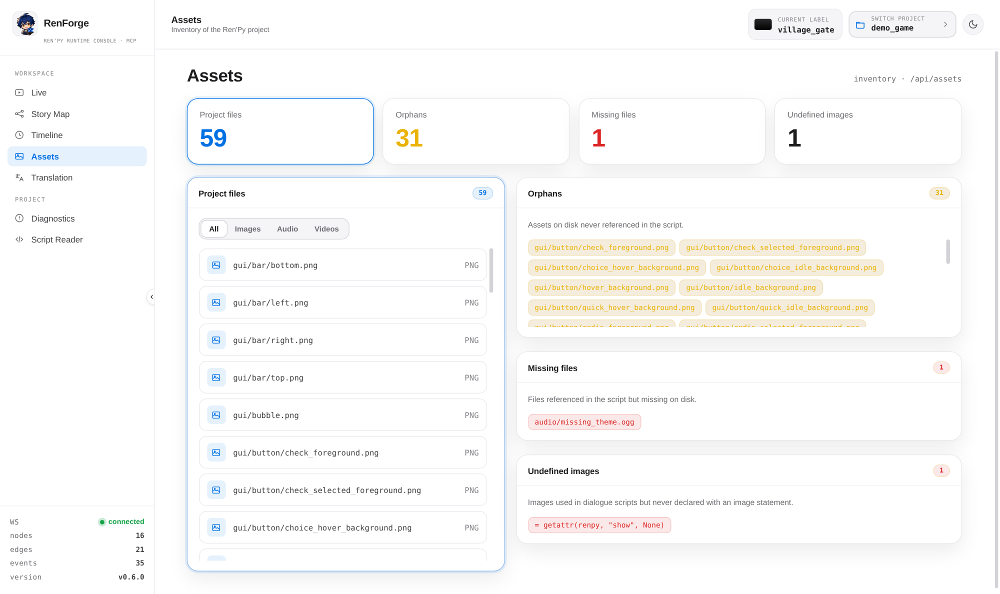

# RenForge

[](https://pypi.org/project/renforge/)
[](https://pypi.org/project/renforge/)
[](LICENSE)
[](https://github.com/alex-jordan547/renforge-mcp/actions/workflows/ci.yml)

RenForge is an **MCP (Model Context Protocol) server, CLI, and web dashboard**
for working with [Ren'Py](https://www.renpy.org/) visual-novel projects.

It lets an AI agent — or a human via the dashboard — inspect a project, launch
and drive a running game, read/write game state, capture screenshots, generate
translations, find orphaned assets, run builds, and search Ren'Py's docs.

> Status: **alpha**, actively developed. The core surfaces (MCP tools, in-game
> bridge, CLI, dashboard) are functional; APIs may still change.



<table>
  <tr>
    <td width="50%">
      
    </td>
    <td width="50%">
      
    </td>
  </tr>
  <tr>
    <td align="center"><em>Story map — click a node to warp the running game</em></td>
    <td align="center"><em>Asset audit — orphans, missing files, undefined images</em></td>
  </tr>
</table>

## What it does

- **Project inspection** — summarize structure, scan scripts/labels/assets,
  parse lint output.
- **Live game control** — launch a project with an injected in-game bridge, then
  advance dialogue, list/select choices, evaluate expressions, get/set store
  variables, poll pushed events, and capture frames the model can literally see.
- **Autopilot** — auto-play the game across branches and report label coverage
  and crashes.
- **Assets & translations** — find orphaned/missing image+audio assets, list
  languages, compute translation stats, generate/update `game/tl/<lang>/` files,
  export dialogue as text.
- **Builds** — package desktop distributions and web builds.
- **Docs** — search and read Ren'Py's offline documentation.
- **Web dashboard** — Starlette + WebSocket UI with a live story map, activity
  log, autopilot coverage, lint view, and game-state controls.

## Quick start

Requires Python 3.11+. With [uv](https://docs.astral.sh/uv/) installed, no
setup is needed:

```bash
# Start the web dashboard
uvx --from "renforge[ui]" renforge ui
```

Then choose your game in the dashboard's project picker — no path to type. (Or
skip the picker with `--project /path/to/your/game`.)

Prefer a persistent install? [pipx](https://pipx.pypa.io/) puts `renforge` on
your PATH in an isolated environment:

```bash
pipx install "renforge[ui]"
renforge ui
```

On managed systems (Debian/Ubuntu), plain `pip install` is blocked by
[PEP 668](https://peps.python.org/pep-0668/) — use `uvx` or `pipx` instead.

## Use with your AI agent

The complete operational reference is available in
[docs/MCP.md](docs/MCP.md). This README keeps the installation examples below;
the guide documents the full tool catalogue, safety guards, visual interaction,
and troubleshooting.

The MCP server command is the same everywhere:

```bash
uvx renforge@latest serve
```

The `@latest` suffix makes `uvx` fetch the newest published RenForge on each
start instead of silently reusing a cached older build — so new tools land
without a manual `uv cache clean`. Drop it (`uvx renforge serve`) if you prefer
to pin whatever is already cached.

Every RenForge tool takes a `project_path` argument, so the agent passes your
game's path on each call — no path substitution in the configs below. Copy them
as-is. The optional `--project` flag on `renforge serve` still sets a default
project for activity logging.

| Client | Where to configure |
| --- | --- |
| [Claude Code](#claude-code) | `claude mcp add` (one command) |
| [Claude Desktop](#claude-desktop-cursor-windsurf-cline-gemini-cli) | `claude_desktop_config.json` |
| [Cursor](#claude-desktop-cursor-windsurf-cline-gemini-cli) | `.cursor/mcp.json` |
| [Windsurf](#claude-desktop-cursor-windsurf-cline-gemini-cli) | `~/.codeium/windsurf/mcp_config.json` |
| [Cline](#claude-desktop-cursor-windsurf-cline-gemini-cli) | `cline_mcp_settings.json` |
| [Gemini CLI](#claude-desktop-cursor-windsurf-cline-gemini-cli) | `~/.gemini/settings.json` |
| [VS Code (Copilot)](#vs-code-github-copilot) | `.vscode/mcp.json` |
| [Zed](#zed) | `settings.json` → `context_servers` |
| [Codex CLI](#codex-cli) | `codex mcp add` or `~/.codex/config.toml` |

### Claude Code

```bash
claude mcp add renforge -- uvx renforge@latest serve
```

### Claude Desktop, Cursor, Windsurf, Cline, Gemini CLI

These clients share the same `mcpServers` JSON shape — add this to the config
file listed in the table above:

```json
{
  "mcpServers": {
    "renforge": {
      "command": "uvx",
      "args": ["renforge@latest", "serve"]
    }
  }
}
```

### VS Code (GitHub Copilot)

`.vscode/mcp.json` in your workspace:

```json
{
  "servers": {
    "renforge": {
      "command": "uvx",
      "args": ["renforge@latest", "serve"]
    }
  }
}
```

### Zed

In `settings.json`:

```json
{
  "context_servers": {
    "renforge": {
      "source": "custom",
      "command": "uvx",
      "args": ["renforge@latest", "serve"]
    }
  }
}
```

### Codex CLI

```bash
codex mcp add renforge -- uvx renforge@latest serve
```

Or edit `~/.codex/config.toml` (on Windows: `%USERPROFILE%\.codex\config.toml`):

```toml
[mcp_servers.renforge]
command = "uvx"
args = ["renforge@latest", "serve"]
```

### Verify it works

After configuring your client, ask the agent:

> Inspect my Ren'Py project at /path/to/game

The agent should call `renforge_inspect_project` with that path and return a
JSON summary of the project (labels, scripts, assets, and related metadata).

> **Windows / GUI clients:** Desktop apps (Claude Desktop, Cursor, etc.) may not
> inherit your shell `PATH`. If `uvx` is not found, set `command` to the
> absolute path of `uvx` (for example `C:\Users\you\.local\bin\uvx.exe`).

> Don't have `uv`? Run `pipx install renforge`, then replace `uvx renforge@latest`
> with `renforge` in your config (and `pipx upgrade renforge` to update).

## Install (dev)

```bash
python -m venv .venv
source .venv/bin/activate
pip install -e .             # MCP runtime (includes fastmcp)
pip install -e ".[fastmcp]"  # alias for the base install
pip install -e ".[ui]"       # dashboard (starlette, uvicorn, watchfiles)
pip install -e ".[test]"     # pytest
```

The server falls back to a compatibility mode with a clear message if
`fastmcp` is not installed (for example after a minimal manual install).

## Usage

### CLI

```bash
renforge --version
renforge inspect <project>      # lightweight project summary (JSON)
renforge serve [--project .]    # start the MCP server (stdio transport)
renforge ui [--project <project>] [--port 8765]  # start the web dashboard
```

### MCP server

`renforge serve` exposes the tools below to any MCP client. A subset:

- `renforge_inspect_project`, `renforge_scan_project`, `renforge_parse_lint`
- `renforge_info`, `renforge_context` (discover the project selected in the dashboard)
- `renforge_find_references`, `renforge_inspect_image`
- `renforge_launch`, `renforge_jump`, `renforge_new_game`, `renforge_stop`
- `renforge_game_state`, `renforge_game_state_compact`, `renforge_advance`, `renforge_control`,
  `renforge_list_choices`, `renforge_select_choice`, `renforge_eval`, `renforge_get_var`,
  `renforge_set_var`, `renforge_poll_events`, `renforge_screenshot`
- `renforge_list_ui_elements`, `renforge_click_element`, `renforge_click_at`,
  `renforge_find_image_on_screen`
- `renforge_get_displayable_bounds`, `renforge_position_element`,
  `renforge_diff_screenshots`
- `renforge_autopilot`
- `renforge_assets`, `renforge_languages`, `renforge_translation_stats`,
  `renforge_generate_translations`, `renforge_export_dialogue`
- `renforge_web_build`, `renforge_distribute`
- `renforge_search_docs`, `renforge_get_doc`, `renforge_list_docs`

Large-project calls are bounded at the tool boundary: `renforge_scan_project`
accepts `sections`, `file_glob`, `symbol`, `offset`, and `limit`, while
`renforge_game_state_compact` omits the full variable store unless
`variable_names` or `variable_prefix` is requested. The original
`renforge_game_state` remains backward compatible. `renforge_screenshot` and
`renforge_inspect_image` accept crop coordinates plus `scale` for close visual
inspection without a separate image-processing script. For visual interaction,
call `renforge_list_ui_elements` first: it returns visible controls, bounds,
semantic text, and a `frame_id`. Pass that id to `renforge_click_element` or
`renforge_click_at` so a stale screenshot cannot silently produce a wrong click.
`renforge_find_image_on_screen` locates a local PNG/template in the current
frame and returns bounds, center, and confidence; its result also includes a
`frame_id` suitable for the guarded click call. Template bounds are in
`coordinate_space: "screenshot"`; pass that value to `renforge_click_at` so
Ren'Py's logical coordinates are derived correctly even when WSLg scales the
captured image.

### Live control

`renforge_launch` injects a bridge into `<project>/game/` (removed on teardown)
and starts the game. If the matching dashboard is running, MCP delegates launch
to that process so it inherits the dashboard's display environment; otherwise
it launches directly. Fully headless CI should wrap direct launches with
`xvfb-run`.

The dashboard publishes its selected project in a per-user local runtime
registry. Agents can call `renforge_info` or `renforge_context` first instead of
guessing the game path. `renforge_jump` resolves a label to `file:line` and
restarts through Ren'Py's supported warp path; `renforge_new_game` starts a
fresh process at the project's `start` label through that same path.

To verify an `.rpy` edit without relaunching the game process:

```text
edit game/script.rpy
renforge_control(project_path, action="reload_script")
renforge_screenshot(project_path)
```

### Web dashboard

`renforge ui` serves a dashboard (default `127.0.0.1:8765`) with a story map,
activity log, autopilot coverage, lint view, and live game controls over
WebSocket. Pick a project from the in-app project picker, or pass
`--project <project>` to open one directly.

## Examples

A small sample project lives in `examples/demo_game/`.

## Architecture

```
src/renforge/
  cli.py            # argparse entrypoint (inspect / serve / ui)
  server.py         # MCP app bootstrap + fallback + tool registration
  bridge/           # in-game .rpy bridge, launcher, and client
  tools/
    live.py         # running-game control (launch, eval, screenshot, ...)
    project_ops.py  # assets, translations, builds, docs
    static.py       # inspect / scan / parse-lint
  ui/               # Starlette dashboard (server, ws, graph, activity, poller)
  dashboard_client.py # private display-bound delegation to the dashboard
  image_ops.py       # local/live image crop and zoom primitives
  navigation.py      # shared label and file:line warp resolution
  session_registry.py # dashboard-to-MCP active-project discovery
  symbols.py         # Ren'Py-aware token/reference lookup
  util/             # filesystem + subprocess helpers
  sdk.py            # Ren'Py SDK download/cache
  scanner.py        # script/label/asset scanning
  lint.py           # lint runner + parsing
  autopilot.py      # branch auto-play + coverage
  translation.py    # translation generation/stats
```

Packaging uses `hatchling`; the console script is
`renforge = renforge.cli:main`.

## License

MIT
