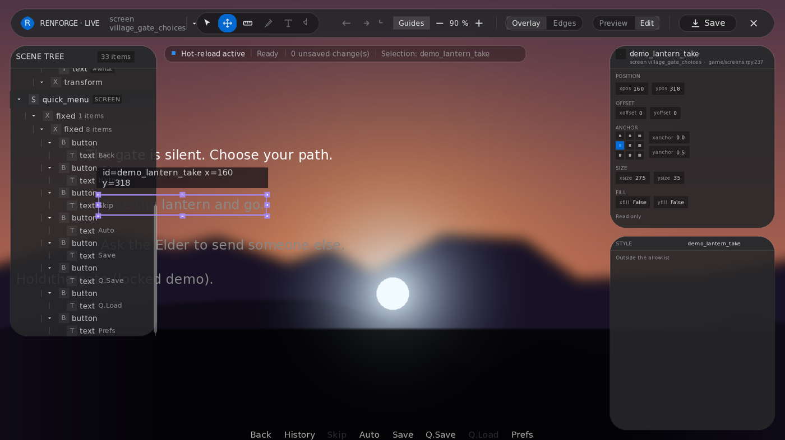
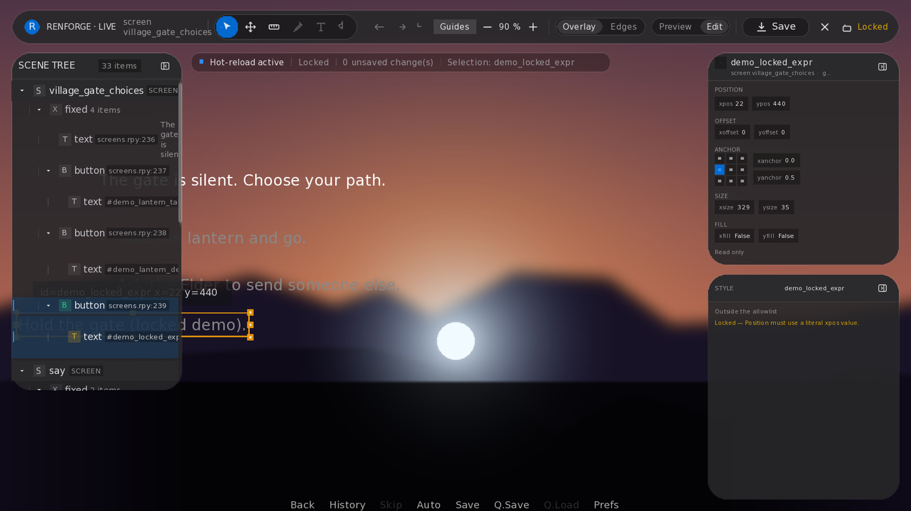

# RenForge Live Editor

The Live Editor is RenForge 0.7's in-game visual editing surface. When you
launch a project through RenForge (`renforge_launch`, the dashboard, or the
CLI UI), the editor is **enabled by default**: a floating **RF** control appears
in the game window. Open it to select displayables, inspect them, preview
layout changes at runtime, and — when a target is editable — write those
changes back to guarded `.rpy` source with **Save**.

This guide is for **humans** (dashboard / game window) and **AI agents**
(public MCP tools only). Deeper tool contracts live in [MCP.md](MCP.md).



*Editable target selected: scene tree, canvas handles, inspector, and style panel.*



*Locked target: still inspectable, with a clear reason why edit-and-save is blocked.*

## What you can and cannot edit

| State | What you can do |
| --- | --- |
| **Editable** | Select, inspect, move / measure / resize (when that capability is available), preview, then **Save** to source. |
| **Locked / read-only** | Select and inspect; the overlay names **why** write-back is blocked (missing identity, unsupported form, ambiguous ancestry, and similar gates). |
| **Not selectable** | Some pure decoration is outside the editor's selection model; use `renforge_scene_tree` to observe layout without selecting. |

Do **not** assume every visible pixel is editable. Treat lock reasons as product
state, not failures to retry blindly.

## Source safety

- **Preview is runtime-only until Save.** Dragging or nudging updates the live
  game; `.rpy` files change only when you press **Save** and the host accepts
  the edit.
- **Locked and unsupported targets stay inspectable.** You can measure and
  understand them without risking a bad write.
- **CAS conflict preservation.** Concurrent or out-of-date source updates are
  not silently overwritten; conflicting evidence is retained rather than
  discarded.
- **Save includes reload and attestation.** A successful **Save** validates and
  publishes the guarded source change, reloads the running script, then verifies
  that the intended result survived the reload. For your own external `.rpy`
  edits, use `renforge_control(project_path, action="reload_script")` and observe
  again.
- **Session-owned bridge/editor artifacts.** Injected bridge and editor files
  belong to the launch session and are cleaned up on a clean
  `renforge_stop` / process teardown. Do not hand-edit generated
  `zzrenforge_*` session files.

## Human workflow (dashboard / game window)

1. **Launch** — `uvx --from "renforge[ui]@latest" renforge ui`, pick your
   project, and start the game (or `renforge_launch` from an MCP client). The
   Live Editor is on by default.
2. **Open the editor** — click the floating **RF** control. Escape / Exit
   returns to the game without writing source.
3. **Select** — click a control on the canvas, or pick it in the scene tree.
4. **Inspect** — read bounds, source location, capabilities, and any lock
   reason in the inspector / status UI.
5. **Edit where allowed** — move, measure, or resize only when the selection
   reports that capability. Preview stays in-memory.
6. **Save** — commit accepted edits to guarded `.rpy` source. RenForge reloads
   and attests the result automatically; wait for the final status before the
   next edit.
7. **Stop cleanly** — exit the game or stop the session from the dashboard so
   session-owned bridge/editor artifacts can tear down.

## Agent workflow (public MCP tools only)

Use **only** public tools from the MCP catalogue. **Never** call private
test-only handlers such as `editor_task0_*` (including status/select variants).
Those exist for internal live suites, not agents.

Recommended sequence:

```text
renforge_info
  -> active_project, live_editor{enabled_by_default, launch_tool, agent_workflow, guide}
renforge_launch(project_path)
  -> ready, or status="starting" after at most 20 seconds
renforge_launch_status(project_path)   # poll while starting
  -> starting | ready | failed | idle
renforge_screenshot(project_path)      # fresh visual observation
renforge_scene_tree(project_path)      # structured layout (logical coords)
  # optional: renforge_list_ui_elements for focusable controls + frame_id
renforge_click_at(
  project_path,
  x=..., y=...,
  coordinate_space="logical",          # or "screenshot" from image search
  expected_frame_id=frame_id,          # when you have one
)
  # or renforge_click_element(project_path, element_id=..., expected_frame_id=frame_id)
renforge_screenshot / renforge_scene_tree / renforge_get_errors
  -> verify visible result, status, or source outcome
renforge_stop(project_path)
```

### Agent rules of thumb

- Call `renforge_info` first; read `live_editor` so you know the editor is
  already part of the launch.
- After every observation or capture that invalidates the frame, **re-list**
  or re-capture before the next guarded click (`expected_frame_id`).
- Prefer `coordinate_space` and `frame_id` values returned by the tools you
  just called; do not invent private bridge RPC names.
- Distinguish **editable** vs **locked** from what the overlay and status UI
  show in screenshots — locked is not “click harder”.
- After a Live Editor **Save**, wait for its final status and observe again; the
  editor already reloaded and attested the change. After your own external `.rpy`
  edits, call `renforge_control(project_path, action="reload_script")` first.
- Always end with `renforge_stop` so the session can clean up.

## Related docs

- [MCP guide](MCP.md) — full tool catalogue, launch lifecycle, scene perception.
- [Architecture](ARCHITECTURE.md) — bridge, packaging, and layout.
- [README](../README.md) — install, dashboard, and product overview.
